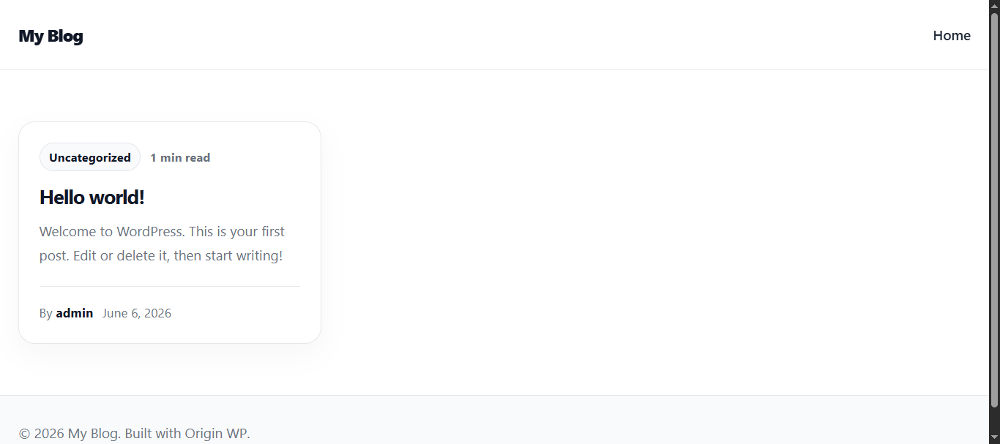

# Origin WP



Origin WP is a lightweight Elementor-ready WordPress theme built for speed, flexibility, and a better blogging experience.

Designed as a clean foundation theme similar in spirit to Hello Elementor, Origin WP provides a minimal frontend, improved blog layouts, enhanced post templates, subtle WordPress admin branding, and WooCommerce compatibility while remaining lightweight and developer-friendly.

---

## Features

### Frontend

* Lightweight and fast-loading architecture
* Elementor-ready
* Full Width Page Template
* Canvas Page Template
* Improved Blog Archive Layouts
* Enhanced Single Post Experience
* Reading Progress Bar
* Estimated Reading Time
* Custom Search Form
* Custom 404 Page
* Responsive Design
* Featured Image Support
* Custom Navigation Menus
* Styled Pagination
* Styled Comments
* Translation Ready

### WordPress Admin

* Origin WP Dashboard Widget
* Custom Login Branding
* Custom Admin Footer Branding
* Admin Bar Branding
* Subtle Admin Interface Styling

### WooCommerce

* WooCommerce Compatibility
* Product Gallery Zoom Support
* Product Gallery Lightbox Support
* Product Gallery Slider Support

---

## Theme Structure

```txt
origin-wp/
├── origin-wp/
│   ├── assets/
│   │   ├── css/
│   │   │   ├── theme.css
│   │   │   ├── blog.css
│   │   │   └── admin.css
│   │   └── js/
│   │       └── theme.js
│   │
│   ├── inc/
│   │   ├── admin.php
│   │   └── template-tags.php
│   │
│   ├── page-templates/
│   │   ├── full-width.php
│   │   └── canvas.php
│   │
│   ├── template-parts/
│   │   ├── post-card.php
│   │   ├── content-single.php
│   │   └── empty.php
│   │
│   ├── header.php
│   ├── footer.php
│   ├── functions.php
│   ├── index.php
│   ├── page.php
│   ├── single.php
│   ├── archive.php
│   ├── search.php
│   ├── searchform.php
│   ├── comments.php
│   ├── 404.php
│   ├── style.css
│   └── screenshot.png
│
├── release/
│   └── origin-wp.zip
│
└── README.md
```

---

## Requirements

```txt
WordPress 6.5+
PHP 8.1+
```

---

## Installation

```txt
1. Download origin-wp.zip from the release folder.
2. Login to WordPress Admin.
3. Navigate to Appearance → Themes.
4. Click Add New.
5. Click Upload Theme.
6. Upload origin-wp.zip.
7. Activate Origin WP.
```

---

## Recommended Plugins

```txt
Elementor
WooCommerce
WP Mail SMTP
Rank Math SEO
LiteSpeed Cache
```

---

## Development Goals

Origin WP focuses on:

* Performance
* Clean Code
* Builder Compatibility
* Better Blogging Experience
* Minimal Design Philosophy
* Long-Term Maintainability

The theme intentionally avoids unnecessary animations, visual clutter, and excessive configuration options in order to remain lightweight and reliable.

---

## Screenshot

Place the official theme screenshot here:

```txt
origin-wp/screenshot.png
```

Recommended dimensions:

```txt
1200 × 900 px
```

---

## License

```txt
GNU General Public License v2.0 or later
```

Origin WP is distributed under the GPL-2.0 license and may be modified, redistributed, and extended in accordance with the license terms.
